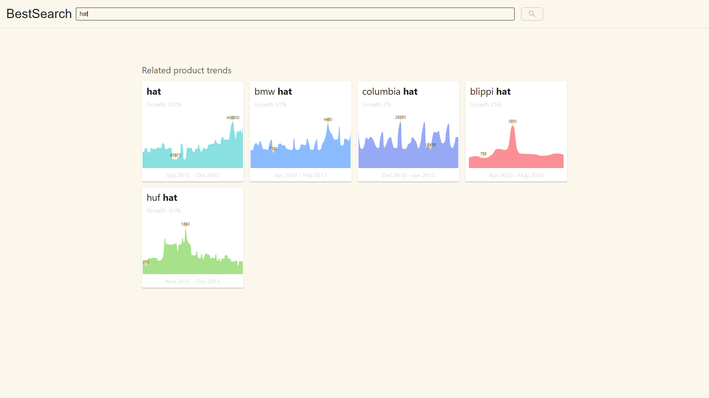
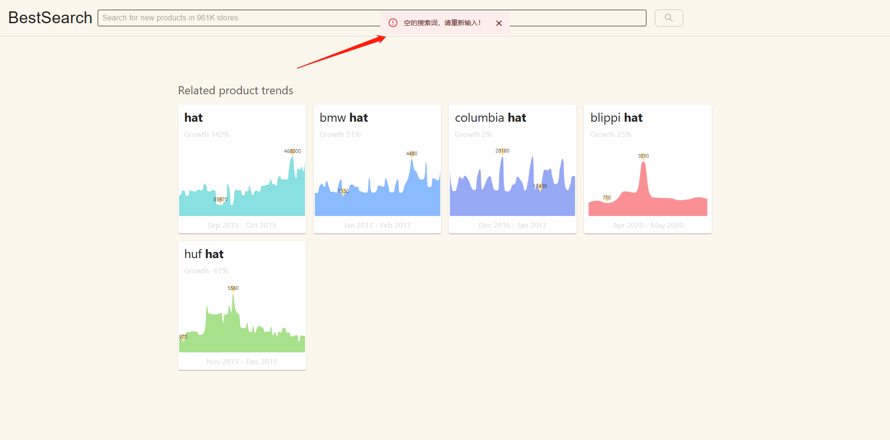
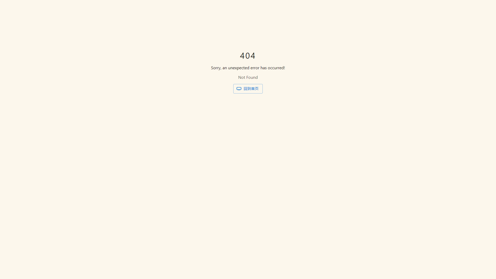

### 写在前面

**代码全部使用 React Hook + TypeScript，使用以下 React 生态包**

- [React Router](https://reactrouter.com/en/6.8.1/start/overview)
- [React Redux](https://react-redux.js.org/)
- [React Thunk](https://redux.js.org/tutorials/fundamentals/part-6-async-logic#using-the-redux-thunk-middleware)
- [Material UI](https://mui.com/core/)

**除要求的依赖以外，另外安装了以下依赖，所有依赖版本都是 `@latest`**

- [less](https://less.bootcss.com/)——处理样式，个人不喜欢用sass
- [echarts](https://echarts.apache.org/)——绘制图表
- [ahooks](https://ahooks.js.org/)——性能优化&更丰富的Hook

> 另外：某些样式的地方与视频显示的有些许差异

### 运行环境

  开发时使用到的运行环境，如果无法正常运行，可以尝试将环境更新到一致

- node v16
- npm v8

### 安装依赖

注意：请不要带`$`符号，之后所有`shell`命令都不需要

``` shell
$ npm install
```

### 运行开发环境

``` shell
$ npm run start
```

### 项目结构

```
├── config                 		# eject webpack 配置
├── md_img						# README 用到的图片
├── public						# 静态资源文件
├── scripts						# 执行脚本
├── src
│   ├── api   					# 接口文件夹
│   ├── app              		# 全局导出Redux和Hook
│   ├── components          	# 业务通用组件，含Header和搜索框
│   ├── models              	# Redux 数据流
│   ├── pages               
		└── _Home           	# 首页
		└── Exception.tsx   	# 异常显示页面
		└── index.ts   			# 统一导出页面
		└── Search          	# 搜索页
			└── index.tsx       # 页面文件
			└── ChartBox.tsx    # 图表组件
			└── MySkeleton.tsx  # 数据请求时预览骨架
├── index.css					# 全局样式
├── index.tsx					# 入口文件
├── README.md
└── package.json
```

### 页面预览

**首页**


**搜索页**

>- 支持搜索框搜索或直接输入路由地址
>
>- 空的搜索内容将会提示警告





**异常页面**

> 以下两种情况将会出现异常显示页面
>
> - 页面渲染出错
> - 未定义的路由


