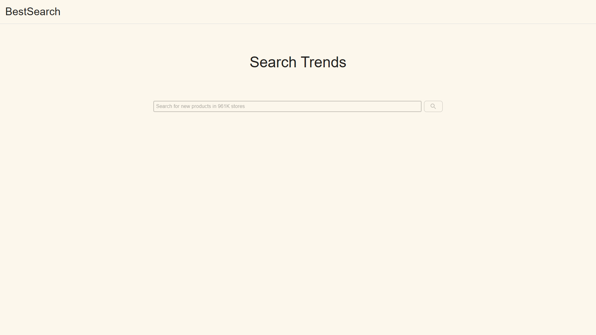

### 写在前面

**代码全部使用 React Hook + TypeScript，使用以下 React 生态包，所有依赖版本都是 `@latest`**

- [React Router](https://reactrouter.com/en/6.8.1/start/overview)
- [React Redux](https://react-redux.js.org/)
- [React Thunk](https://redux.js.org/tutorials/fundamentals/part-6-async-logic#using-the-redux-thunk-middleware)
- [Material UI](https://mui.com/core/)

**除要求的依赖以外，另外安装了以下依赖，所有依赖版本都是 `@latest`**

- [less](https://less.bootcss.com/)——处理样式，个人不喜欢用sass
- [echarts](https://echarts.apache.org/)——绘制图表
- [ahooks](https://ahooks.js.org/)——性能优化&更丰富的Hook

> 另外：某些样式的地方与视频显示的有些许差异

### 运行环境

  开发时使用到的运行环境，如果无法正常运行，可以尝试将环境更新到一致

- node v16
- npm v8 或 yarn v1.2.7

### 本地运行项目

> 注意：请不要带`$`符号，之后所有`shell`命令都不需要

**拉取代码**

``` shell
$ git clone https://github.com/U-Wen/BestSearch.git
```

注：如果拉取失败，请尝试切换代理

**安装依赖**

``` shell
# if use npm
$ npm install

# if use yarn
$ yarn
```

### 运行开发环境

``` shell
# if use npm
$ npm run start

# if use yarn
$ yarn start
```

注：首次启动较慢，请耐心等待

### 项目结构

```
├── config                 		# eject webpack 配置
├── md_img				# README 用到的图片
├── public				# 静态资源文件
├── scripts				# 执行脚本
├── src
│   ├── api   				# 接口文件夹
│   ├── app              		# 全局导出Redux和Hook
│   ├── components          		# 业务通用组件，含Header和搜索框
│   ├── models              		# Redux 数据流
│   ├── pages               
	└── _Home           		# 首页
	└── Exception.tsx   		# 异常显示页面
	└── index.ts   			# 统一导出页面
	└── Search          		# 搜索页
		└── index.tsx       	# 页面文件
		└── ChartBox.tsx    	# 图表组件
		└── MySkeleton.tsx  	# 数据请求时预览骨架
├── index.css				# 全局样式
├── index.tsx				# 入口文件
├── README.md
└── package.json
```

### 页面预览

> 如果在线图片显示异常，是DNS污染导致，可以尝试以下方式
>
> 1. 直接移步 `/md_img/` 目录查看图片
>
> 2. 如果有查看 Markdown 的软件（如：Typora），拉取代码后本地打开
>
> 3. 开启代理
>
> 4. 修改系统 `hosts` 文件
>
>    ``` ini
>    # windows 目录：C:\Windows\System32\drivers\etc
>    # mac/linux 目录：/etc/hosts
>    # 在末尾新增以下内容，保存后刷新页面
>    199.232.68.133 raw.githubusercontent.com
>    199.232.68.133 githubusercontent.com
>    ```

**首页**



**搜索页**

>- 支持搜索框搜索或直接输入路由地址搜索
>
>- 空的搜索内容将会提示警告


**异常页面**

> 以下两种情况将会出现异常显示页面
>
> - 页面渲染出错
> - 未定义的路由


